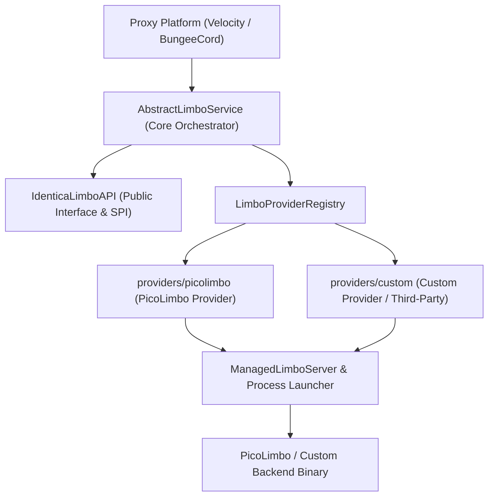

# Identica Limbo

[](https://adoptium.net/)
[](https://papermc.io/software/velocity)
[](https://www.spigotmc.org/)
[](https://github.com/whereareiam)
[](LICENSE)

A high-performance, modular **Velocity** and **BungeeCord** proxy addon for **Identica** that dynamically manages virtual Limbo servers. It isolates unauthenticated, pending, or queueing players inside ultra-lightweight Limbo instances while minimizing resource overhead and maximizing security.

---

## Table of Contents

- [Architecture Overview](#architecture-overview)
- [Features](#features)
- [Requirements](#requirements)
- [Installation & Deployment](#installation--deployment)
  - [Velocity Proxy](#velocity-proxy)
  - [BungeeCord / Waterfall Proxy](#bungeecord--waterfall-proxy)
- [Directory Layout](#directory-layout)
- [Commands & Permissions](#commands--permissions)
- [Configuration Reference](#configuration-reference)
  - [Global Settings (`config.yml`)](#global-settings-configyml)
  - [Virtual Server Definitions (`limbo/*.yml`)](#virtual-server-definitions-limboyml)
  - [Coordinate & Rotation Formats](#coordinate--rotation-formats)
- [Developer API (`IdenticaLimboAPI`)](#developer-api-identicalimboapi)
  - [Adding the Dependency](#adding-the-dependency)
  - [Accessing the API](#accessing-the-api)
  - [Player Transfers & Evacuation](#player-transfers--evacuation)
  - [Status & Telemetry Queries](#status--telemetry-queries)
  - [Provider Management via API](#provider-management-via-api)
- [Implementing a Custom Limbo Provider](#implementing-a-custom-limbo-provider)
  - [Core SPI Architecture](#core-spi-architecture)
  - [Method 1: Internal Provider Module (`providers/<name>`)](#method-1-internal-provider-module-providersname)
  - [Method 2: External Plugin Provider via Public API](#method-2-external-plugin-provider-via-public-api)
- [Building from Source](#building-from-source)
- [Troubleshooting & FAQ](#troubleshooting--faq)

---

## Architecture Overview

Identica Limbo is designed with a strictly decoupled multi-module architecture:



### Module Structure
- **`:api`**: Clean, zero-dependency public API containing `IdenticaLimboAPI`, `LimboProvider`, `ManagedLimboServer`, and `VirtualServerDefinition`.
- **`:common`**: Shared core runtime logic, YAML configuration loader, abstract limbo service, logging abstraction, and dynamic configuration contributor registry.
- **`:limbo-adapter-command`**: Integration bridge registering subcommands into Identica's command dispatch tree.
- **`:providers:picolimbo` (`providers/picolimbo`)**: Built-in backend for [PicoLimbo](https://github.com/Quozul/PicoLimbo) containing isolated components for platform detection, archive extraction, checksum verification, process lifecycle, and typed configuration enums.
- **`:velocity`**: Platform implementation for Velocity 3.4.0+ proxies, producing `IdenticaLimbo-VELOCITY-1.0.0.jar`.
- **`:bungeecord`**: Platform implementation for BungeeCord / Waterfall proxies, producing `IdenticaLimbo-BUNGEECORD-1.0.0.jar`.

---

## Features

- **Embedded Managed Backend**: Out-of-the-box support for **PicoLimbo** (`PICOLIMBO`) with automated GitHub binary downloads, SHA-256 verification, process lifecycle management, and graceful shutdown.
- **Pluggable Provider SPI (`LimboProvider`)**: Modular backend SPI allowing any custom limbo implementation (e.g. NanoLimbo, custom TCP mock servers, containerized instances) to be plugged in effortlessly.
- **Multi-Proxy Support**: Native platform bindings and fat JARs for both **Velocity** and **BungeeCord** (Waterfall).
- **Public Developer API (`IdenticaLimboAPI`)**: Non-blocking asynchronous API for player routing, single/bulk transfers, emergency evacuation, and live telemetry.
- **Strictly Typed Configuration**: Modern typed `enum` values for game modes, dimensions, and player forwarding with case-insensitive parsing and validation.
- **Human-Readable Semicolon Coordinates**: Semicolon-delimited coordinates (`"X;Y;Z"` and `"Yaw;Pitch"`) with full backward compatibility for legacy YAML arrays.
- **Identica Command Integration**: Deeply integrated into Identica's command dispatch tree under `/identica limbo`.

---

## Requirements

- **Proxy Platform**:
  - [Velocity 3.4.0+](https://papermc.io/software/velocity) OR
  - [BungeeCord / Waterfall 1.20+](https://www.spigotmc.org/)
- **Java Runtime**: **Java 21** or newer (utilizes virtual threads and modern process APIs)
- **Core Dependency**: **Identica** proxy plugin installed and enabled
- **Network**: Outgoing HTTPS access to GitHub (only required if `autoDownload: true` is enabled for PicoLimbo)

---

## Installation & Deployment

### Velocity Proxy
1. Ensure the **Identica** plugin is installed in `plugins/`.
2. Download or build `IdenticaLimbo-VELOCITY-1.0.0.jar` and place it into `plugins/`.
3. Start Velocity once to generate default configuration files:
   - `plugins/identica-limbo/config.yml`
   - `plugins/identica-limbo/limbo/server1-picolimbo.yml`
4. If using `MODERN` forwarding, ensure the secret key in `picolimbo.forwarding.secret` matches `forwarding.secret` in Velocity's `velocity.toml`.
5. Restart or reload Velocity.

### BungeeCord / Waterfall Proxy
1. Ensure the **Identica** plugin is installed in `plugins/`.
2. Download or build `IdenticaLimbo-BUNGEECORD-1.0.0.jar` and place it into `plugins/`.
3. Start BungeeCord once to generate configuration files.
4. If using `BUNGEE_GUARD` forwarding, set `picolimbo.forwarding.method` to `BUNGEE_GUARD` and provide your BungeeGuard token in `picolimbo.forwarding.secret`.
5. Restart or reload BungeeCord.

---

## Directory Layout

```text
plugins/identica-limbo/
├── config.yml                      # Global settings, command configuration & localization
└── limbo/                          # Virtual Limbo server definitions
    ├── auth-1.yml                  # PicoLimbo virtual server #1
    ├── auth-2.yml                  # PicoLimbo virtual server #2
    └── fallback.yml                # Custom/alternative backend server
```

Each `.yml` file inside `limbo/` represents an independently managed virtual server registered directly into your proxy server registrar.

---

## Commands & Permissions

Commands are registered under the root `/identica` command namespace.

| Command | Permission | Description |
| :--- | :--- | :--- |
| `/identica limbo` | `identica.admin.limbo` | Displays command overview and usage instructions. |
| `/identica limbo list` | `identica.admin.limbo` | Lists all active and configured virtual Limbo servers. |
| `/identica limbo info <name>` | `identica.admin.limbo` | Displays detailed status, process PID, memory, uptime, and players. |
| `/identica limbo reload` | `identica.admin.limbo` | Hot-reloads configuration files and synchronizes managed processes. |

---

## Configuration Reference

### Global Settings (`config.yml`)

Manages command registration, aliases, permissions, and MiniMessage-formatted localization strings.

```yaml
commands:
  limbo:
    enabled: true
    aliases: ["limbo"]
    permission: "identica.admin.limbo"
    description: "Manage Identica Limbo servers."
    usage: "{command} {alias}"
  list:
    enabled: true
    aliases: ["limbo list"]
    permission: "identica.admin.limbo"
    description: "List registered limbo servers."
    usage: "{command} {alias}"
  info:
    enabled: true
    aliases: ["limbo info"]
    permission: "identica.admin.limbo"
    description: "Show detailed status of a limbo server."
    usage: "{command} {alias} <name>"
    arguments:
      name: "Limbo server name"
  reload:
    enabled: true
    aliases: ["limbo reload"]
    permission: "identica.admin.limbo"
    description: "Reload limbo configuration."
    usage: "{command} {alias}"

messages:
  usage: "<white>Usage: /identica limbo list, /identica limbo info <name>, /identica limbo reload"
  listEmpty: "<yellow>No virtual servers registered."
  listHeader: "<green>Virtual servers:"
  listEntry: "<gray>- <name> [<provider>] <host>:<port>"
  infoMissing: "<red>Server not found: <name>"
  infoFound: |
    <gray>Server Information for <gold><name></gold>:</gray>
    <gray>• Provider: <white><provider></white></gray>
    <gray>• Status: <status></gray>
    <gray>• Address: <white><address></white></gray>
    <gray>• Players: <white><players></white></gray>
    <gray>• Memory: <white><memory></white></gray>
    <gray>• Uptime: <white><uptime></white></gray>
    <gray>• Details: <white><details></white></gray>
  reloadSuccess: "<green>Limbo configuration successfully reloaded."
  reloadFailure: "<red>Failed to reload Limbo configuration."
  status:
    active: "<green>Active</green> <gray>(in-process)</gray>"
    running: "<green>Running</green>"
    runningWithPid: "<green>Running</green> <gray>(PID: {pid})</gray>"
    stopped: "<red>Stopped</red>"
    rawActive: "ACTIVE"
    rawRunning: "RUNNING"
    rawStopped: "STOPPED"
  address:
    virtual: "Virtual (in-proxy)"
  players:
    empty: "0"
    listEmpty: "none"
    withNames: "{count} <gray>({names})</gray>"
  details:
    dimension: "World: {dimension}"
    gameMode: "Mode: {gamemode}"
    schematic: "Schematic: {schematic}"
    separator: " | "
    none: "—"
  duration:
    days: "d "
    hours: "h "
    minutes: "m "
    seconds: "s"
    zero: "0s"
  memory:
    bytes: "{value} B"
    kilobytes: "{value} KB"
    megabytes: "{value} MB"
    gigabytes: "{value} GB"
    jvm: "{used} / {max} (JVM)"
    notAvailable: "N/A"
```

---

### Virtual Server Definitions (`limbo/*.yml`)

Each file contains a general `server` block and provider-specific configuration extensions.

#### Example: PicoLimbo Backend (`server1-picolimbo.yml`)

```yaml
server:
  name: "auth-1"
  enabled: true
  type: "PICOLIMBO"
  host: "127.0.0.1"
  port: 30066

picolimbo:
  paths:
    # Directory to store downloaded release archives (empty = workingDirectory)
    download: ""
    # Path to pre-existing binary (empty = auto-resolved in installation directory)
    executable: ""
    # Working directory for server runtime and temporary files (empty = OS temp dir)
    workingDirectory: ""
  lifecycle:
    # Automatically start the backend process on proxy startup
    autoStart: true
    # Automatically download PicoLimbo binary and default schematic from GitHub
    autoDownload: true
  release:
    # Release version tag from Quozul/PicoLimbo GitHub repository (e.g. "latest" or "v1.1.0")
    version: "latest"
  world:
    # Path to custom WorldEdit .schem file (empty = downloads default spawn.schem)
    schematic: ""
    # Chat message sent to the player upon entering limbo
    welcomeMessage: ""
    # Action bar text shown to the player
    actionBar: ""
    # Game mode: "survival", "creative", "adventure", "spectator"
    gameMode: "spectator"
    # World dimension: "overworld", "nether", "end"
    dimension: "overworld"
    spawn:
      # Format: "X;Y;Z"
      position: "20.5;17.0;22.5"
      # Format: "Yaw;Pitch"
      rotation: "-90.0;0.0"
    # Client render view distance (chunks: 1 to 32)
    viewDistance: 2
    # Lock world time to freeze daylight cycle
    lockTime: false
  forwarding:
    # Forwarding mode: "NONE", "MODERN", "BUNGEE_GUARD"
    method: "MODERN"
    # Forwarding secret key (Velocity modern secret or BungeeGuard token)
    secret: ""
  # Stream backend stdout & stderr to the proxy console logger
  logging: true
```

---

### Coordinate & Rotation Formats

Identica Limbo provides a concise semicolon-delimited string format for position and rotation:

- **Position**: `"X;Y;Z"` (e.g. `"20.5; 17.0; 22.5"`)
- **Rotation**: `"Yaw;Pitch"` (e.g. `"-90.0; 0.0"`)

> [!TIP]
> Whitespace around the delimiter is automatically trimmed. The legacy YAML array syntax (`position: [20.5, 17.0, 22.5]` and `rotation: [-90.0, 0.0]`) remains fully supported for backward compatibility.

---

## Developer API (`IdenticaLimboAPI`)

Identica Limbo provides an asynchronous public API for programmatic control, player routing, and telemetry.

### Adding the Dependency

#### Gradle (`build.gradle.kts`)
```kotlin
repositories {
    mavenCentral()
    maven("https://repo.papermc.io/repository/maven-public/")
}

dependencies {
    compileOnly("dev.scarday:identicalimbo-api:1.0.0")
}
```

#### Maven (`pom.xml`)
```xml
<dependency>
    <groupId>dev.scarday</groupId>
    <artifactId>identicalimbo-api</artifactId>
    <version>1.0.0</version>
    <scope>provided</scope>
</dependency>
```

---

### Accessing the API

Obtain the global singleton instance:

```java
import dev.scarday.identicalimbo.api.IdenticaLimboAPI;

IdenticaLimboAPI api = IdenticaLimboAPI.get();
```

---

### Player Transfers & Evacuation

All transfer operations return non-blocking `CompletableFuture` instances:

```java
import java.util.UUID;

// 1. Transfer player by UUID
UUID playerUuid = ...;
api.transfer(playerUuid, "auth-1").thenAccept(success -> {
    if (success) {
        System.out.println("Player transferred successfully.");
    }
});

// 2. Transfer player by username
api.transfer("PlayerName", "auth-1");

// 3. Evacuate all online players to Limbo (e.g. before proxy maintenance)
api.transferAll("auth-1").thenAccept(evacuatedUuids -> {
    System.out.println("Evacuated " + evacuatedUuids.size() + " players to limbo.");
});

// 4. Evacuate players from a specific backend server (e.g. restarting 'hub-1')
api.transferAll("hub-1", "auth-1").thenAccept(evacuatedUuids -> {
    System.out.println("Evacuated " + evacuatedUuids.size() + " players from hub-1 to auth-1.");
});
```

---

### Status & Telemetry Queries

```java
// Check if a registered server is an Identica Limbo server
boolean isLimbo = api.isLimbo("auth-1");

// Query player counts
int authOnline = api.getOnlineCount("auth-1");
int totalLimboOnline = api.getTotalOnlineCount();

// List player usernames currently connected to a Limbo server
List<String> players = api.getConnectedPlayers("auth-1");

// Query server telemetry (process status, PID, memory, uptime, world details)
api.status("auth-1").ifPresent(status -> {
    System.out.println("Server: " + status.name());
    System.out.println("Provider: " + status.provider());
    System.out.println("Running: " + status.running());
    System.out.println("PID: " + status.pid());
    System.out.println("Memory: " + status.memoryBytes() + " bytes");
    System.out.println("Started: " + status.startedAt());
    System.out.println("Dimension: " + status.dimension());
    System.out.println("GameMode: " + status.gameMode());
});

// Hot-reload configuration programmatically
api.reload();
```

---

### Provider Management via API

You can inspect or manipulate registered providers dynamically:

```java
import dev.scarday.identicalimbo.api.provider.LimboProviderRegistry;
import dev.scarday.identicalimbo.api.LimboProviderType;

LimboProviderRegistry registry = api.providers();

// Check if a provider is registered
boolean hasPico = registry.find(LimboProviderType.PICOLIMBO).isPresent();

// Unregister a provider
registry.unregister(LimboProviderType.of("CUSTOM_LIMBO"));
```

---

## Implementing a Custom Limbo Provider

The plugin is architected around the `LimboProvider` SPI. You can implement custom limbo backends (such as NanoLimbo, custom netty servers, or dockerized instances).

### Core SPI Architecture

A custom provider requires implementing three main abstractions:

1. **`LimboProviderType`**: Unique identifier for your provider type.
2. **`ManagedLimboServer`**: Represents an active or stopped instance of your server.
3. **`LimboProvider`**: Factory that instantiates `ManagedLimboServer` from `VirtualServerDefinition` and `LimboServerContext`.

---

### Method 1: Internal Provider Module (`providers/<name>`)

To add a new built-in provider to the codebase (e.g. `providers/nanolimbo`):

#### 1. Define the Gradle Subproject (`providers/nanolimbo/build.gradle.kts`)
```kotlin
plugins {
    `java-library`
}

dependencies {
    compileOnly(project(":api"))
    compileOnly(project(":common"))
    compileOnly(libs.lombok)
    annotationProcessor(libs.lombok)
    compileOnly(libs.jackson.databind)
}
```

#### 2. Include in `settings.gradle.kts`
```kotlin
include(
    ":api",
    ":common",
    ":limbo-adapter-command",
    ":providers:picolimbo",
    ":providers:nanolimbo", // Add your module here
    ":velocity",
    ":bungeecord"
)
```

#### 3. Implement the Provider Configuration Document
```java
package dev.scarday.identicalimbo.provider.nanolimbo;

import lombok.Getter;
import lombok.Setter;

@Getter
@Setter
public class NanoLimboDocument {
    private String jarPath = "nanolimbo.jar";
    private int maxPlayers = 100;
}
```

#### 4. Implement `ManagedLimboServer`
```java
package dev.scarday.identicalimbo.provider.nanolimbo;

import dev.scarday.identicalimbo.api.VirtualServerDefinition;
import dev.scarday.identicalimbo.api.provider.ManagedLimboServer;
import java.time.Instant;
import java.util.Optional;

public class NanoLimboServer implements ManagedLimboServer {
    private final VirtualServerDefinition definition;
    private Process process;
    private final Instant startedAt;

    public NanoLimboServer(VirtualServerDefinition definition, Process process, Instant startedAt) {
        this.definition = definition;
        this.process = process;
        this.startedAt = startedAt;
    }

    @Override
    public VirtualServerDefinition definition() {
        return definition;
    }

    @Override
    public boolean isRunning() {
        return process != null && process.isAlive();
    }

    @Override
    public Optional<Long> pid() {
        return isRunning() ? Optional.of(process.pid()) : Optional.empty();
    }

    @Override
    public long memoryBytes() {
        return -1L; // Return RSS or process memory in bytes if known
    }

    @Override
    public Instant startedAt() {
        return startedAt;
    }

    @Override
    public String dimension() {
        return "overworld";
    }

    @Override
    public String gameMode() {
        return "spectator";
    }

    @Override
    public String schematic() {
        return null;
    }

    @Override
    public void close() {
        if (process != null) {
            process.destroyForcibly();
            process = null;
        }
    }
}
```

#### 5. Implement `LimboProvider`
```java
package dev.scarday.identicalimbo.provider.nanolimbo;

import dev.scarday.identicalimbo.api.LimboProviderType;
import dev.scarday.identicalimbo.api.VirtualServerDefinition;
import dev.scarday.identicalimbo.api.provider.LimboProvider;
import dev.scarday.identicalimbo.api.provider.LimboServerContext;
import dev.scarday.identicalimbo.api.provider.ManagedLimboServer;
import dev.scarday.identicalimbo.common.config.VirtualServerDefaults;
import dev.scarday.identicalimbo.common.config.VirtualServerDocument;
import java.time.Instant;

public class NanoLimboProvider implements LimboProvider {
    public static final LimboProviderType TYPE = LimboProviderType.of("NANOLIMBO");

    static {
        // Register default configuration contributor for servers/*.yml
        VirtualServerDefaults.registerContributor(doc -> {
            if (doc.getExtensions() != null) {
                doc.getExtensions().putIfAbsent("nanolimbo", new NanoLimboDocument());
            }
        });
    }

    @Override
    public LimboProviderType type() {
        return TYPE;
    }

    @Override
    public ManagedLimboServer createServer(VirtualServerDefinition definition, LimboServerContext context) throws Exception {
        // Extract provider-specific configuration
        VirtualServerDocument doc = (VirtualServerDocument) context.document();
        Object rawConfig = doc.getExtensions().get("nanolimbo");

        // Start process
        Process process = new ProcessBuilder("java", "-jar", "nanolimbo.jar").start();
        Instant startedAt = Instant.now();

        // Register server with the proxy (Velocity / BungeeCord)
        context.registrar().register(definition);
        context.logInfo("Started NanoLimbo server {} at {}:{}", definition.name(), definition.host(), definition.port());

        return new NanoLimboServer(definition, process, startedAt);
    }
}
```

#### 6. Register in Proxy Services
In `velocity/build.gradle.kts` and `bungeecord/build.gradle.kts`, add:
```kotlin
implementation(project(":providers:nanolimbo"))
```
Then in `VelocityLimboService` and `BungeeCordLimboService`:
```java
providerRegistry.register(new NanoLimboProvider());
```

---

### Method 2: External Plugin Provider via Public API

Any external plugin running on the proxy can register custom Limbo backends without modifying Identica Limbo:

```java
import dev.scarday.identicalimbo.api.IdenticaLimboAPI;
import dev.scarday.identicalimbo.api.LimboProviderType;
import dev.scarday.identicalimbo.api.VirtualServerDefinition;
import dev.scarday.identicalimbo.api.provider.LimboProvider;
import dev.scarday.identicalimbo.api.provider.LimboServerContext;
import dev.scarday.identicalimbo.api.provider.ManagedLimboServer;

public class ExternalProviderPlugin extends Plugin {
    @Override
    public void onEnable() {
        IdenticaLimboAPI.get().providers().register(new LimboProvider() {
            @Override
            public LimboProviderType type() {
                return LimboProviderType.of("DOCKER_LIMBO");
            }

            @Override
            public ManagedLimboServer createServer(VirtualServerDefinition def, LimboServerContext ctx) {
                // Launch container / remote proxy instance
                ctx.registrar().register(def);
                return new MyManagedServer(def);
            }
        });
    }
}
```

Once registered, users can immediately target it in `limbo/custom-server.yml`:

```yaml
server:
  name: "auth-docker"
  enabled: true
  type: "DOCKER_LIMBO"
  host: "10.0.0.5"
  port: 25565
```

---

## Building from Source

### Prerequisites
- **JDK 21** or higher
- Git

### Build Command
Run the root Gradle build:

```bash
./gradlew clean check build
```

Compiled artifacts will be located in the root `build/` directory:

```text
build/
├── IdenticaLimbo-VELOCITY-1.0.0.jar
└── IdenticaLimbo-BUNGEECORD-1.0.0.jar
```

---

## Troubleshooting & FAQ

### 1. `PicoLimbo executable is missing` or `Permission denied`
Ensure the user running the proxy has write permissions to the working directory. On Linux, if using a manual binary, ensure executable permissions are set:
```bash
chmod +x /path/to/pico_limbo
```

### 2. Modern forwarding authentication fails on Velocity
Ensure the secret in your server YAML matches the proxy secret:
- Server configuration: `picolimbo.forwarding.secret: "your-secret"`
- Velocity configuration: `forwarding.secret` in `velocity.toml`

### 3. Port already in use (`Address already in use`)
Each virtual server in `limbo/*.yml` must bind to a unique port:
```yaml
server:
  host: "127.0.0.1"
  port: 30067 # Ensure this port is not used by other services
```

---

## License

This project is licensed under the [MIT License](LICENSE).
