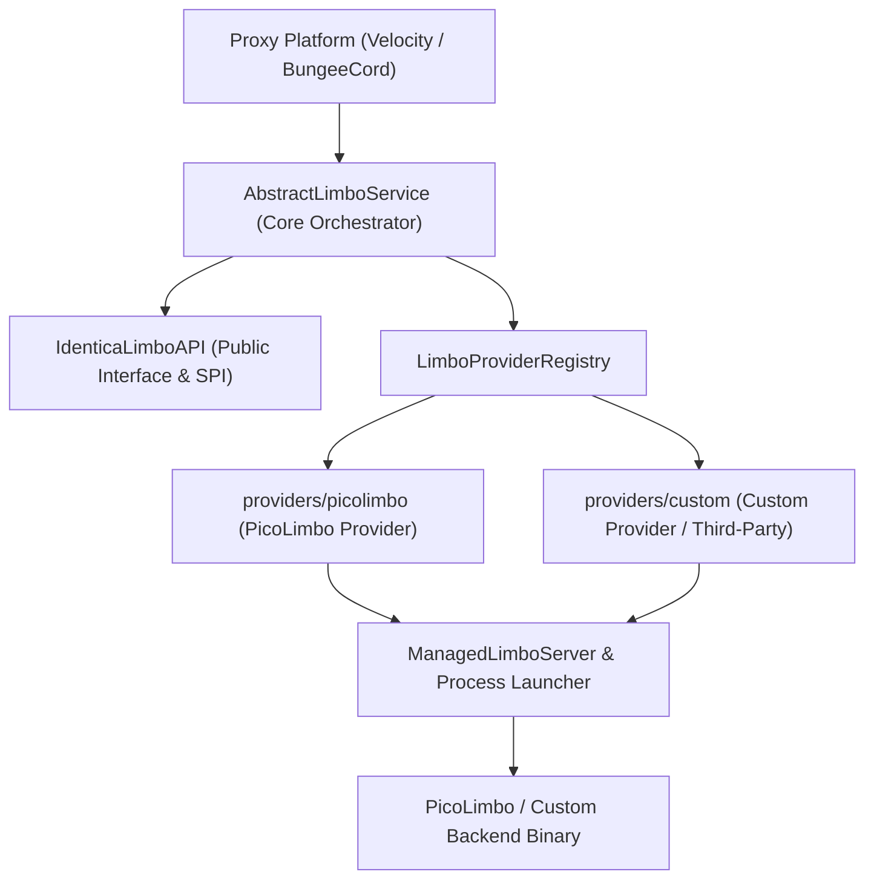

# Identica Limbo

[](https://adoptium.net/)
[](https://papermc.io/software/velocity)
[](https://www.spigotmc.org/)
[](https://github.com/whereareiam)
[](LICENSE)

A high-performance, modular **Velocity** and **BungeeCord** proxy addon for **Identica** that dynamically manages virtual Limbo servers. It isolates unauthenticated or pending players within lightweight Limbo instances while minimizing resource overhead.

---

## 📚 Documentation

Detailed documentation is organized into dedicated guides:

| Guide | Description |
| :--- | :--- |
| ⚙️ **[Configuration Guide](docs/configuration.md)** | Full reference for `config.yml`, `limbo/*.yml`, typed enums, and coordinate formats. |
| 🛠 **[Developer API Guide](docs/api.md)** | Public `IdenticaLimboAPI`, player routing, bulk evacuation, and live telemetry queries. |
| 🔌 **[Custom Providers Guide](docs/providers.md)** | Implementing custom Limbo backends (internally in `providers/` or via public API). |

---

## Architecture Overview



### Module Structure
- **`:api`**: Public API (`IdenticaLimboAPI`, `LimboProvider`, `ManagedLimboServer`, `VirtualServerDefinition`).
- **`:common`**: Shared core runtime, config loader, abstract service, defaults contributors, and logging.
- **`:limbo-adapter-command`**: Command adapter for Identica's command dispatch tree.
- **`:providers:picolimbo` (`providers/picolimbo`)**: Built-in PicoLimbo provider implementation with isolated modules.
- **`:velocity`**: Platform module for Velocity proxies producing `IdenticaLimbo-VELOCITY-2.0.0.jar`.
- **`:bungeecord`**: Platform module for BungeeCord / Waterfall proxies producing `IdenticaLimbo-BUNGEECORD-2.0.0.jar`.

---

## Quick Start & Installation

### Requirements
- **Java 21** or newer
- **Velocity 3.4.0+** OR **BungeeCord / Waterfall 1.20+**
- **Identica** proxy plugin installed and enabled

### Installation
1. Download or build the artifact matching your proxy:
   - **Velocity**: `build/IdenticaLimbo-VELOCITY-2.0.0.jar`
   - **BungeeCord**: `build/IdenticaLimbo-BUNGEECORD-2.0.0.jar`
2. Place the JAR into your proxy's `plugins/` folder.
3. Start the proxy to generate default configuration files:
   - `plugins/identica-limbo/config.yml`
   - `plugins/identica-limbo/limbo/server1-picolimbo.yml`
4. Configure forwarding:
   - **Velocity**: Use `MODERN` forwarding and set `secret` to match `velocity.toml`.
   - **BungeeCord**: Use `BUNGEE_GUARD` forwarding and set `secret` to your BungeeGuard token.
5. Reload or restart the proxy.

---

## Commands & Permissions

Commands are registered under the `/identica` command namespace:

| Command | Permission | Description |
| :--- | :--- | :--- |
| `/identica limbo` | `identica.admin.limbo` | Displays command overview and help. |
| `/identica limbo list` | `identica.admin.limbo` | Lists all registered virtual Limbo servers. |
| `/identica limbo info <name>` | `identica.admin.limbo` | Displays status, PID, memory, uptime, and players. |
| `/identica limbo reload` | `identica.admin.limbo` | Hot-reloads configuration and synchronizes processes. |

---

## Building from Source

```bash
./gradlew clean check build
```

Compiled JARs will be generated in the root `build/` directory:

```text
build/
├── IdenticaLimbo-VELOCITY-2.0.0.jar
└── IdenticaLimbo-BUNGEECORD-2.0.0.jar
```

To run a test proxy server directly:
- **Velocity**: `./gradlew :velocity:runVelocity`
- **Waterfall**: `./gradlew :bungeecord:runWaterfall`

---

## License

This project is licensed under the [MIT License](LICENSE).
